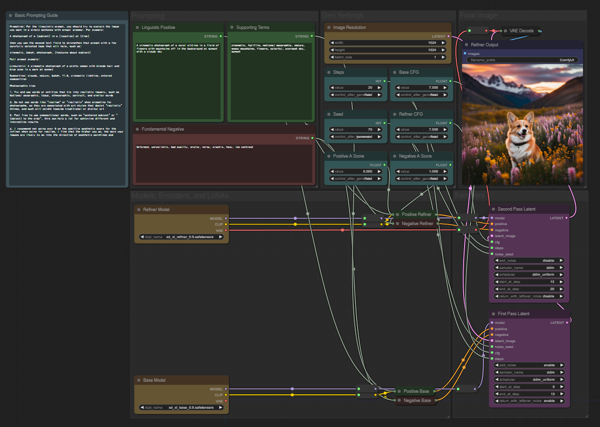

# ComfyUI with SDXL 0.9

This repository provides a Colab notebook (`comfyui_colab_sd_xl_0.9.ipynb`) and a JSON file(`Sytan SDXL Workflow v0.5`) for using ComfyUI with SDXL 0.9.

## Getting Started

1. Download the Colab notebook and JSON file from this repository.
2. Open the Colab notebook (`ComfyUI_with_SDXL_0.9.ipynb`) in Google Colab.
3. Follow the instructions in the notebook to execute the cells in order.
4. There are two ways to download the SDXL model checkpoints. Choose one of the following:  
(You need to have access to the sdxl repository):
   - **Option 1**

     Replace `your_username` and `your_password` with your Hugging Face username and password in the code below.
     ```shell
     !wget -c --user=your_username --password=your_password https://huggingface.co/stabilityai/stable-diffusion-xl-base-0.9/resolve/main/sd_xl_base_0.9.safetensors -P ./models/checkpoints/
     !wget -c --user=your_username --password=your_password https://huggingface.co/stabilityai/stable-diffusion-xl-refiner-0.9/resolve/main/sd_xl_refiner_0.9.safetensors -P ./models/checkpoints/
     ```

   - **Option 2**

    Run the following code cell:
    ```python
    import getpass
    import urllib.request

    username = getpass.getpass('huggingface 사용자 이름을 입력하세요:')
    password = getpass.getpass('비밀번호를 입력하세요:')
    urls = [
        'https://huggingface.co/stabilityai/stable-diffusion-xl-base-0.9/resolve/main/sd_xl_base_0.9.safetensors',
        'https://huggingface.co/stabilityai/stable-diffusion-xl-refiner-0.9/resolve/main/sd_xl_refiner_0.9.safetensors'
    ]
    save_paths = [
        './models/checkpoints/SDXL Base.safetensors',
        './models/checkpoints/SDXL Refiner.safetensors'
    ]

    def auth_download(url, save_path):
        password_mgr = urllib.request.HTTPPasswordMgrWithDefaultRealm()
        password_mgr.add_password(None, url, username, password)
        auth_handler = urllib.request.HTTPBasicAuthHandler(password_mgr)
        opener = urllib.request.build_opener(auth_handler)
        urllib.request.install_opener(opener)
        try:
            urllib.request.urlretrieve(url, save_path)
            print(save_path, '설치 완료')
        except Exception as e:
            print('오류가 발생했습니다:', e)

    for i in range(len(urls)):
        auth_download(urls[i], save_paths[i])
     ```

    Provide your Hugging Face ID and password when prompted.

5. Download the provided JSON file from this repository.
6. Run ComfyUI and follow these steps:

   - Click on the "Clear" button to reset the workflow.
   - Click on the "Load" button.
   - Select the downloaded JSON file to import the workflow.
   - Click on the "Queue Prompt" button to run the workflow.

For more details and information about ComfyUI and SDXL and JSON file, please refer to the respective repositories.
- [ComfyUI](https://github.com/comfyanonymous/ComfyUI)
- [stabilityai/stable-diffusion-xl-base-0.9](https://huggingface.co/stabilityai/stable-diffusion-xl-base-0.9)
- [stabilityai/stable-diffusion-xl-refiner-0.9](https://huggingface.co/stabilityai/stable-diffusion-xl-refiner-0.9)
- [Sytan-SDXL-ComfyUI](https://github.com/SytanSD/Sytan-SDXL-ComfyUI)
